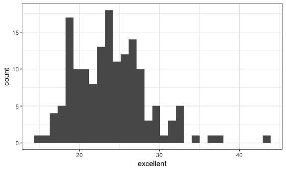
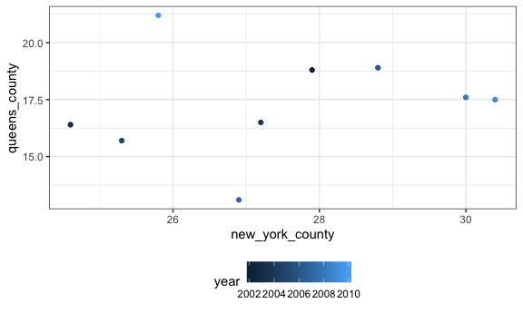

Homework 2
================
Aakriti Gupta
2018-10-03

``` r
library(tidyverse)
```

    ## ── Attaching packages ──────────────────────────────────────────────────────────────────── tidyverse 1.2.1 ──

    ## ✔ ggplot2 3.0.0     ✔ purrr   0.2.5
    ## ✔ tibble  1.4.2     ✔ dplyr   0.7.6
    ## ✔ tidyr   0.8.1     ✔ stringr 1.3.1
    ## ✔ readr   1.1.1     ✔ forcats 0.3.0

    ## ── Conflicts ─────────────────────────────────────────────────────────────────────── tidyverse_conflicts() ──
    ## ✖ dplyr::filter() masks stats::filter()
    ## ✖ dplyr::lag()    masks stats::lag()

``` r
knitr::opts_chunk$set(
  fig.width = 6,
  fig.asp = .6,
  out.width = "90%"
)

theme_set(theme_bw() + theme(legend.position = "bottom"))
```

**Problem 1**
-------------

### *Import and clean the CSV*

``` r
nyc_transit = read_csv(file = "./data/NYC_Transit_Data.csv") %>% 
  janitor::clean_names() %>% 
  select(line, station_name, station_latitude, station_longitude, starts_with("route"), entry, vending, entrance_type, ada) %>% 
  mutate(entry = recode(entry, "YES" = TRUE, "NO" = FALSE)) 
```

    ## Parsed with column specification:
    ## cols(
    ##   .default = col_character(),
    ##   `Station Latitude` = col_double(),
    ##   `Station Longitude` = col_double(),
    ##   Route8 = col_integer(),
    ##   Route9 = col_integer(),
    ##   Route10 = col_integer(),
    ##   Route11 = col_integer(),
    ##   ADA = col_logical(),
    ##   `Free Crossover` = col_logical(),
    ##   `Entrance Latitude` = col_double(),
    ##   `Entrance Longitude` = col_double()
    ## )

    ## See spec(...) for full column specifications.

This dataset contains information about the NYC subway stations, lines and routes served by them and whetehr they have options for vending or not or whether tehy are ADA compliant or not.

I imported the csv using thr readr package and then cleaned using janitor package. Then, I used the dplyr package to select certain variables and mutate the entry variable from a character to a logical variable.

There are 465 unique stations:

``` r
 nyc_transit %>% 
  distinct(line, station_name) 
```

    ## # A tibble: 465 x 2
    ##    line     station_name            
    ##    <chr>    <chr>                   
    ##  1 4 Avenue 25th St                 
    ##  2 4 Avenue 36th St                 
    ##  3 4 Avenue 45th St                 
    ##  4 4 Avenue 53rd St                 
    ##  5 4 Avenue 59th St                 
    ##  6 4 Avenue 77th St                 
    ##  7 4 Avenue 86th St                 
    ##  8 4 Avenue 95th St                 
    ##  9 4 Avenue 9th St                  
    ## 10 4 Avenue Atlantic Av-Barclays Ctr
    ## # ... with 455 more rows

The number of stations that are ADA compliant are 468

``` r
count(nyc_transit, ada)
```

    ## # A tibble: 2 x 2
    ##   ada       n
    ##   <lgl> <int>
    ## 1 FALSE  1400
    ## 2 TRUE    468

Reformatting the dataset:

``` r
nyc_transit_tidy = nyc_transit %>%
  gather(key = "route_number", value = "route_name", route1:route11) %>%
  select(route_name, route_number, everything()) %>% 
  group_by(route_name, route_number) %>%
  separate(route_number, into = c("route_str", "number"), sep = 5) %>% 
  select(-route_str) 
```

The A train serves 60 distinct stations:

``` r
nyc_transit_tidy %>%
  group_by(route_name) %>%
  filter(route_name == "A") %>% 
  distinct(route_name, line, station_name)
```

    ## # A tibble: 60 x 3
    ## # Groups:   route_name [1]
    ##    route_name line            station_name                 
    ##    <chr>      <chr>           <chr>                        
    ##  1 A          42nd St Shuttle Times Square                 
    ##  2 A          8 Avenue        125th St                     
    ##  3 A          8 Avenue        145th St                     
    ##  4 A          8 Avenue        14th St                      
    ##  5 A          8 Avenue        168th St - Washington Heights
    ##  6 A          8 Avenue        175th St                     
    ##  7 A          8 Avenue        181st St                     
    ##  8 A          8 Avenue        190th St                     
    ##  9 A          8 Avenue        34th St                      
    ## 10 A          8 Avenue        42nd St                      
    ## # ... with 50 more rows

**Problem 2**
-------------

### *Importing and cleaning the trash wheel sheet*

``` r
trash_wheel = readxl::read_excel(path = "./data/HealthyHarborWaterWheelTotals2018-7-28.xlsx", sheet = 1, range = "A2:N258") %>% 
  janitor::clean_names() %>% 
  filter(!is.na(dumpster)) %>% 
  mutate(
    sports_balls = NULL, 
    sports_balls_i = as.integer(sports_balls))
```

### *Importing and cleaning the sheet for 2016 precipitation data*

``` r
ppt_2016 = readxl::read_excel(path = "./data/HealthyHarborWaterWheelTotals2017-9-26.xlsx", sheet = 4, skip = 1) %>% 
  janitor::clean_names() %>% 
  filter(!is.na(month)) %>% 
  mutate(year = 2016)
```

### *Importing and cleaning the sheet for 2017 precipitation data*

``` r
ppt_2017 = readxl::read_excel(path = "./data/HealthyHarborWaterWheelTotals2017-9-26.xlsx", sheet = 3, skip = 1) %>% 
  janitor::clean_names() %>% 
  filter(!is.na(total), !is.na(month)) %>% 
  mutate(year = 2017)
```

### *Binding the rows to have a combined dataset and changing the month column from numbers to names*

``` r
ppt_tidy = bind_rows(ppt_2016, ppt_2017) %>%
  janitor::clean_names() %>%
  select(year, everything()) %>% 
  mutate(month =  month.name[month])
```

Mr. Trash Wheel is “a water-wheel vessel that removes trash from the Inner Harbor in Baltimore, Maryland.” It (or he) sits at an intake into the Inner Harbor and intercepts litter and debris carried by the Jones Falls River toward the harbor. It has removed over a million pounds of litter since May 2014! The total precipitation in 2017 was 29.93. The median number of sportsballs in a dumpster in 2016 was 26

### Problem 3

Loading the dataset

``` r
library(p8105.datasets)
data(brfss_smart2010)
```

Cleaning, wrangling and tidying data:

``` r
brfss = brfss_smart2010 %>% 
  janitor::clean_names() %>% 
  filter(topic == "Overall Health") %>% 
  select(-class, -topic, -question, -sample_size, -(confidence_limit_low:geo_location)) %>%
  mutate(response = tolower(response)) %>% 
  spread(key = "response", value = "data_value") %>% 
  janitor::clean_names() %>% 
  mutate(excellent_or_very_good = excellent + very_good)
```

1.  Unique locations represented in the dataset are:

``` r
brfss %>% 
  group_by(locationabbr) %>% summarise(count = n()) 
```

    ## # A tibble: 51 x 2
    ##    locationabbr count
    ##    <chr>        <int>
    ##  1 AK              11
    ##  2 AL              18
    ##  3 AR              21
    ##  4 AZ              32
    ##  5 CA              52
    ##  6 CO              59
    ##  7 CT              47
    ##  8 DC               9
    ##  9 DE              27
    ## 10 FL             122
    ## # ... with 41 more rows

This yields 51 unique locations. Every state is represented. New Jersey is represented the most with frequency of 146.

1.  

``` r
brfss %>% 
  group_by(year) %>% 
  filter(year == 2002) %>% 
  summarize(median = median(excellent, na.rm = TRUE))
```

    ## # A tibble: 1 x 2
    ##    year median
    ##   <int>  <dbl>
    ## 1  2002   23.6

For the year 2002, the median value for excellent response is 23.6.

1.  Histogram

``` r
brfss %>% 
  group_by(year) %>% 
  filter(year == 2002) %>% 
ggplot(aes(x = excellent)) + geom_histogram()
```

    ## `stat_bin()` using `bins = 30`. Pick better value with `binwidth`.

    ## Warning: Removed 2 rows containing non-finite values (stat_bin).



1.  Scatterplot

``` r
 brfss %>% 
 filter(locationabbr == "NY") %>% 
  separate(locationdesc, into = c("state", "county"), sep = "-") %>%
  select(year, county, excellent) %>%
  spread(key = "county", value = "excellent") %>%
  janitor::clean_names() %>%
  select(year, queens_county, new_york_county) %>%
  ggplot(aes(x = new_york_county, y = queens_county)) + 
  geom_point(aes(color = year))
```


